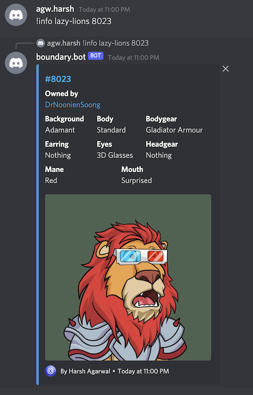
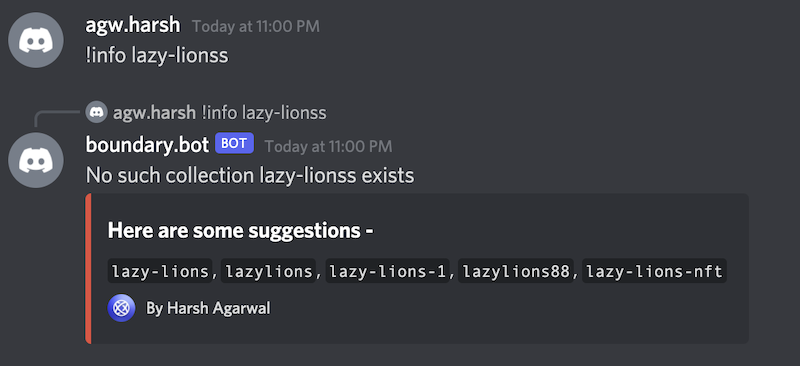
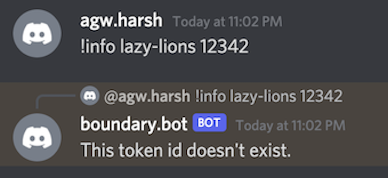

# Discord Bot for OpenSea

This project helps you to get information regarding any collection and any item within the collection. I have also added auto-suggestion for collection slugs which gives you suggestion whenever given collection-slug doesn't exist.
It also send notification to your discord channel for new listings and new sales of your specified collection. 

## Commands
 - info &#60;collection-slug&#62;
 - info &#60;collection-slug&#62; &#60;token-number&#62;

## Screenshot

### config

You can edit the prefix in config.py file. You also have to add the discord bot token for this to run.

